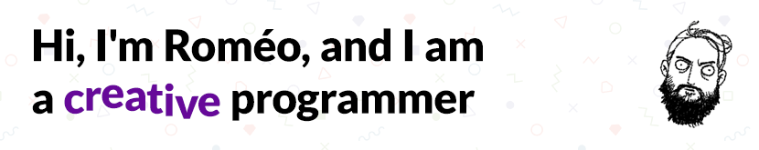

<h3>I like to make things work, move, and feel good 👌</h3>
<h4>
    <i>I am a software architect and full-stack developer with a deep love for UI-driven frontend development.</i>
</h4>

    
    

---

I'm always making something in one way or another:

- 🎮&nbsp;&nbsp;Games and music with JIM at <a href="https://romjim.games">ROMJIM</a>  
- 👨‍💼&nbsp;&nbsp;&nbsp;Engineering management & software architecture at <a href="https://landr.com">LANDR</a>  

    

        
            📚
        
        <strong>Languages</strong>
    

    

        
        
        
        
        
        
        
        
        
    

    

        
            🔨
        
        <strong>Tools & Frameworks</strong>
    

    

        
        
        
        
        
        
        
        
        
        
        
        
    

    

        
           🏗️ 
        
        <strong>Infrastructure</strong>
    

    

        
        
        
        
        
        
    

