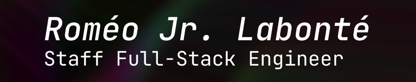

### Hey 👋 I’m a highly self-driven frontend engineer who likes designing systems and creating pixel-perfect interfaces. I love making things move, look, and feel good.
#### _Outside of work, you can often find me working on [England in London](https://romjim.games), fiddling with my Neovim config, or unreasonably grinding all achievements in some games._

 

&nbsp;

---

**I'm always making something in one way or another:**

- 🎮&nbsp;&nbsp;Games and music with JIM at <a href="https://romjim.games">ROMJIM</a>

---

    

        <strong>📚&nbsp;&nbsp;Languages</strong>
    

     
    &nbsp;
    &nbsp;
    &nbsp;
    &nbsp;
    <picture>
        <source width="32" height="32" media="(prefers-color-scheme: dark)" height="32" width="32" src="https://simpleicons.vercel.app/c/fff" />&nbsp;
        &nbsp;
    </picture>
    <picture>
        <source width="32" height="32" media="(prefers-color-scheme: dark)" height="32" width="32" src="https://simpleicons.vercel.app/rust/fff" />&nbsp;
        &nbsp;
    </picture>
    &nbsp;

    

       <strong>🔨&nbsp;&nbsp;Tools & Frameworks</strong>
    

     
    &nbsp;
    &nbsp;
    <picture>
        <source width="32" height="32" media="(prefers-color-scheme: dark)" height="32" width="32" src="https://simpleicons.vercel.app/nextdotjs/fff" />&nbsp;
        &nbsp;
    </picture>
    &nbsp;
    <picture>
        <source width="32" height="32" media="(prefers-color-scheme: dark)" height="32" width="32" src="https://simpleicons.vercel.app/deno/fff" />&nbsp;
        &nbsp;
    </picture>
    &nbsp;
    &nbsp;
    <picture>
        <source width="32" height="32" media="(prefers-color-scheme: dark)" height="32" width="32" src="https://simpleicons.vercel.app/unity/fff" />&nbsp;
        &nbsp;
    </picture>
    &nbsp;

    

           <strong>🏗️&nbsp;&nbsp;Infrastructure</strong>
    

     
    &nbsp;
    &nbsp;
    <picture>
        <source width="32" height="32" media="(prefers-color-scheme: dark)" height="32" width="32" src="https://simpleicons.vercel.app/githubactions/fff" />&nbsp;
        &nbsp;
    </picture>
    &nbsp;
    &nbsp;

